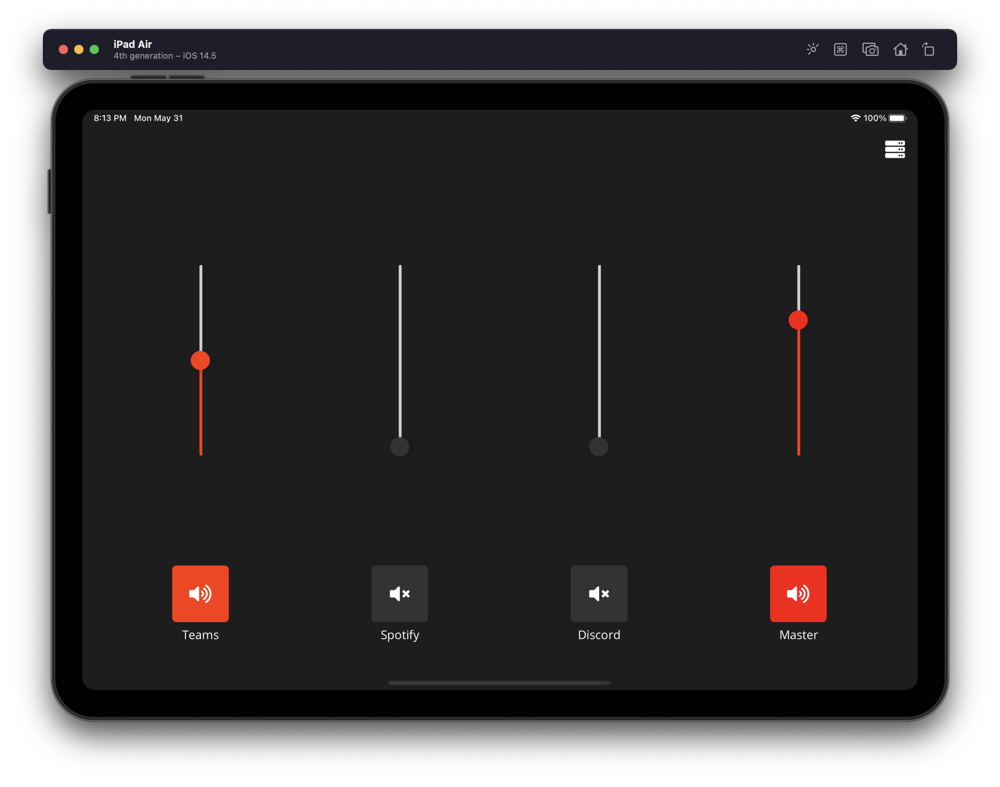

# Volume Mixer

This is an attempt to build a 4 channel mixer app for my old iPad Mini that can control my Windows machine. It is NOT functional (yet).

I'll be trying [MQTT](https://github.com/xamarin/mqtt) to communicate with Windows.

The UI is built with [.NET MAUI](https://dotnet.microsoft.com/en-us/apps/maui).

